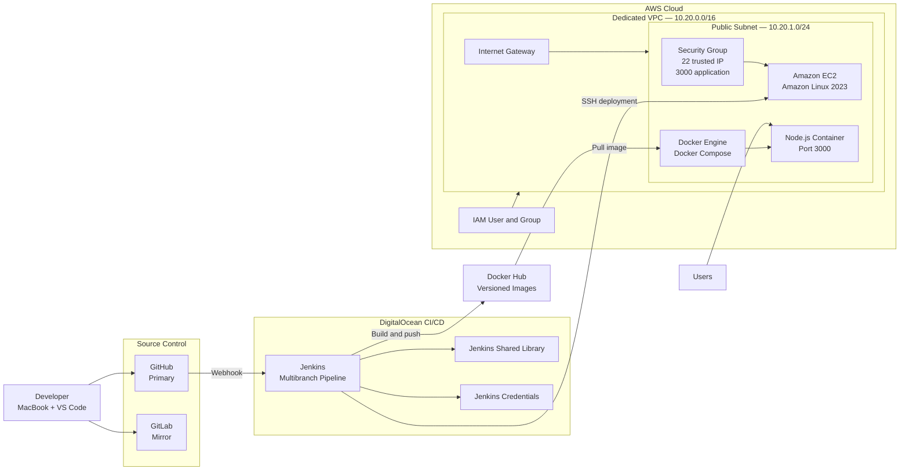

# Node.js AWS EC2 Continuous Deployment with Jenkins

A production-aware DevOps project that provisions dedicated AWS networking and compute resources with the AWS CLI and continuously deploys a tested, versioned Node.js Docker image to Amazon EC2 through Jenkins.

## Project Overview

This project extends a Jenkins continuous integration pipeline into a controlled continuous deployment workflow on AWS.

The infrastructure is created with the AWS CLI rather than through the default VPC or manual EC2 wizard. The application runs as a Docker container on an Amazon Linux EC2 instance inside a dedicated VPC and public subnet.

Jenkins uses branch-aware deployment rules:

- Feature and bugfix branches run automated tests only.
- The `develop` branch runs integration tests only.
- The `main` branch increments the npm version, builds and pushes a Docker image, deploys it to EC2, verifies the HTTP response, and commits the version change.

## Architecture



## Project Objectives

- Create an IAM user and DevOps group.
- Apply controlled AWS permissions.
- Configure an isolated AWS CLI profile.
- Create a dedicated VPC with the AWS CLI.
- Create a public subnet.
- Attach an internet gateway.
- Create and associate a custom route table.
- Create an EC2 security group.
- Restrict SSH to a trusted address.
- Resolve a current Amazon Linux 2023 AMI dynamically.
- Create an encrypted EC2 instance with IMDSv2 required.
- Install Docker and Docker Compose.
- Deploy with a version-controlled Compose file.
- Run automated tests on every branch.
- Deploy only from `main`.
- Store credentials securely in Jenkins.
- Verify the application after deployment.
- Support rollback using immutable image tags.
- Maintain GitHub and GitLab copies.

## Technologies

| Category | Technology |
|---|---|
| Cloud | AWS |
| Networking | Amazon VPC |
| Compute | Amazon EC2 |
| Identity | AWS IAM |
| Provisioning | AWS CLI and Bash |
| CI/CD | Jenkins Multibranch Pipeline |
| Pipeline reuse | Jenkins Shared Library |
| Application | Node.js and Express |
| Testing | Jest |
| Containerization | Docker |
| Deployment | Docker Compose |
| Registry | Docker Hub |
| Source control | GitHub and GitLab |
| CI server | DigitalOcean |
| Operating system | Amazon Linux 2023 |

## Repository Structure

```text
.
├── app/
├── aws/
│   ├── iam/
│   │   └── devops-deployment-policy.json
│   └── scripts/
│       ├── create-network.sh
│       ├── create-ec2.sh
│       ├── validate-infrastructure.sh
│       └── destroy-infrastructure.sh
├── deploy/
│   ├── docker-compose.yaml
│   └── server-commands.sh
├── docs/
│   ├── architecture/
│   └── screenshots/
├── .dockerignore
├── .env.infrastructure.example
├── .gitignore
├── Dockerfile
├── Jenkinsfile
├── LICENSE
└── README.md
```

## Branch and Deployment Policy

| Branch | Tests | Version | Docker Push | EC2 Deploy |
|---|---:|---:|---:|---:|
| `feature/*` | Yes | No | No | No |
| `bugfix/*` | Yes | No | No | No |
| `develop` | Yes | No | No | No |
| `main` | Yes | Yes | Yes | Yes |

This prevents incomplete feature and bugfix branches from modifying the production EC2 environment.

## AWS Network Design

```text
VPC:              10.20.0.0/16
Public subnet:    10.20.1.0/24
Internet route:   0.0.0.0/0 → Internet Gateway
SSH:              TCP 22 from trusted /32 address
Application:      TCP 3000
Region:           ca-central-1
```

## AWS CLI Profile

The project uses a named profile:

```bash
aws configure --profile gafari-devops
```

Validate:

```bash
aws sts get-caller-identity \
  --profile gafari-devops
```

AWS credentials are never stored in this repository.

## Create the Network

Create the local runtime file:

```bash
cp .env.infrastructure.example .env.infrastructure
```

Update the trusted SSH CIDR, then run:

```bash
./aws/scripts/create-network.sh
```

## Create EC2

```bash
./aws/scripts/create-ec2.sh
```

The provisioning script:

- Resolves Amazon Linux 2023 dynamically.
- Creates an ED25519 key pair.
- Requires EC2 Instance Metadata Service version 2.
- Encrypts the root EBS volume.
- Assigns project tags.
- Waits for the instance and status checks.
- Records runtime IDs in the ignored infrastructure environment file.

## Validate Infrastructure

```bash
./aws/scripts/validate-infrastructure.sh
```

## Docker Compose Deployment

The deployed image is supplied at runtime:

```bash
export IMAGE_REPOSITORY=younghadiz/nodejs-jenkins-cicd
export IMAGE_TAG=1.3.0-42
```

The deployment script executes:

```bash
./deploy/server-commands.sh \
  "$IMAGE_REPOSITORY" \
  "$IMAGE_TAG"
```

## Jenkins Credentials

| Credential ID | Type | Purpose |
|---|---|---|
| `github-token` | Username/password | Shared library and Git commit |
| `docker-credentials` | Username/password | Docker Hub push |
| `ec2-server-key` | SSH private key | EC2 deployment |
| `ec2-server-host` | Secret text | EC2 public endpoint |

Credential values are stored only in Jenkins Credentials.

## Pipeline Flow

```text
Validate environment
        ↓
Install dependencies and run tests
        ↓
Is branch main?
   ├── No → Stop successfully
   └── Yes
        ↓
Increment npm version
        ↓
Build Docker image
        ↓
Push immutable and latest tags
        ↓
Copy Compose and deployment script to EC2
        ↓
Pull and start exact image
        ↓
Wait for healthy container
        ↓
Verify external HTTP 200
        ↓
Commit package version files
```

## Local Testing

```bash
cd app
npm ci
npm test -- --runInBand
```

Docker build:

```bash
docker build \
  -t younghadiz/nodejs-jenkins-cicd:local \
  .
```

Run:

```bash
docker run --rm \
  -p 3000:3000 \
  younghadiz/nodejs-jenkins-cicd:local
```

## Deployment Verification

```bash
curl -I http://<ec2-public-ip>:3000
```

On EC2:

```bash
cd /opt/nodejs-aws-jenkins
docker compose ps
docker compose logs --tail=100
```

## Security Practices

- AWS root credentials are not used for project operations.
- An individual IAM user and group are used for the exercise.
- MFA is enabled for console access.
- AWS credentials use a named local profile.
- Credential files are excluded from Git.
- SSH is limited to a trusted `/32` address.
- EC2 uses an encrypted EBS root volume.
- EC2 requires IMDSv2.
- Jenkins credentials store Docker, GitHub, and SSH secrets.
- The EC2 private key is never committed.
- Jenkins verifies the EC2 SSH host key.
- The container uses a read-only root filesystem.
- `no-new-privileges` is enabled.
- Container logs use size and file rotation limits.
- Feature branches cannot deploy.
- Immutable image tags support rollback.
- Destructive infrastructure cleanup requires explicit confirmation.

## Evidence

Sanitized screenshots are stored in:

```text
docs/screenshots/
```

Recommended evidence:

1. IAM user and group.
2. AWS CLI identity validation.
3. Dedicated VPC resource map.
4. Restricted security-group rules.
5. Running EC2 instance.
6. Docker and Compose versions.
7. Feature branch test-only pipeline.
8. Successful main deployment pipeline.
9. Docker Hub immutable image.
10. Application running from EC2.

## Rollback

On EC2:

```bash
cd /opt/nodejs-aws-jenkins

./server-commands.sh \
  younghadiz/nodejs-jenkins-cicd \
  <previous-image-tag>
```

## Cleanup

To remove the lab infrastructure:

```bash
./aws/scripts/destroy-infrastructure.sh
```

Review the resource identifiers carefully before typing:

```text
DELETE
```

## Production Improvements

- Replace IAM user access keys with short-lived role credentials.
- Provision the infrastructure with Terraform.
- Configure EC2 with Ansible.
- Replace public SSH with AWS Systems Manager Session Manager.
- Put the application behind an Application Load Balancer.
- Terminate TLS on port 443.
- Use Route 53 for DNS.
- Store images in Amazon ECR.
- Replace a single EC2 instance with an Auto Scaling Group.
- Add CloudWatch logs and alarms.
- Add Trivy image scanning.
- Add blue/green or rolling deployment.
- Move the workload to Amazon EKS.

## Attribution

The learning requirements originate from the AWS Services exercises in the TechWorld with Nana DevOps Bootcamp.

The repository structure, least-privilege IAM policy, dynamic AMI lookup, AWS CLI automation, EC2 hardening, Jenkins branch strategy, shared-library deployment function, SSH verification, operational scripts, documentation, and portfolio evidence were implemented as an independent DevOps engineering project.


DevOps Engineer | AWS | Kubernetes | Docker | Jenkins | Terraform | Ansible | CI/CD Automation